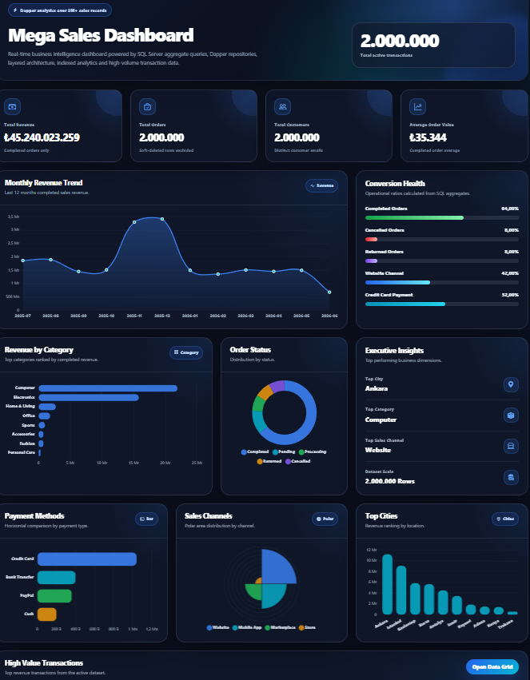
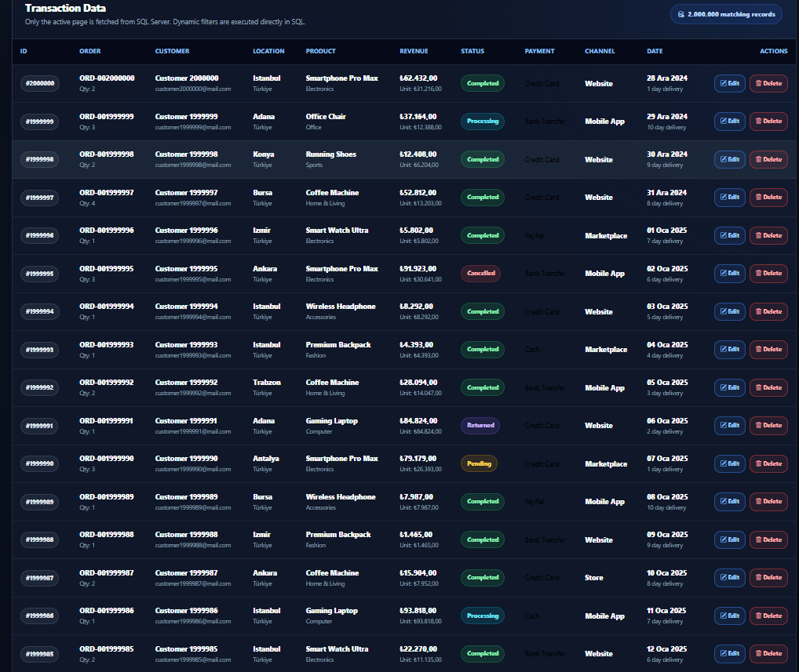
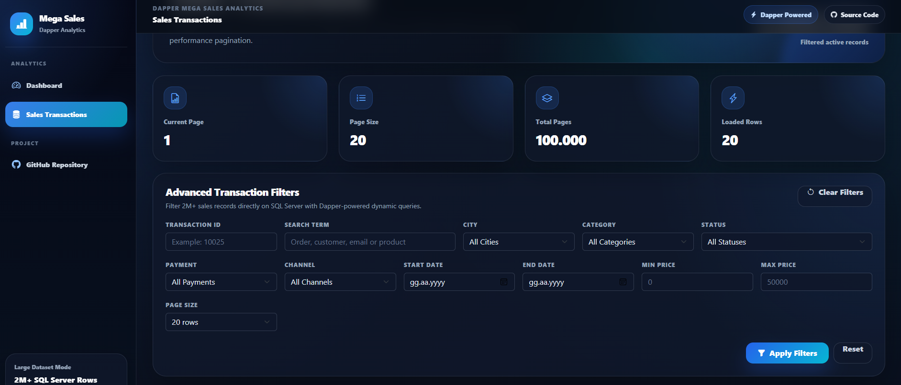
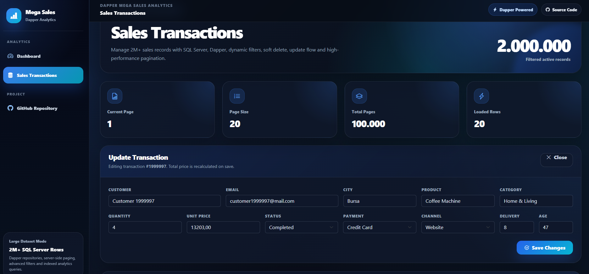
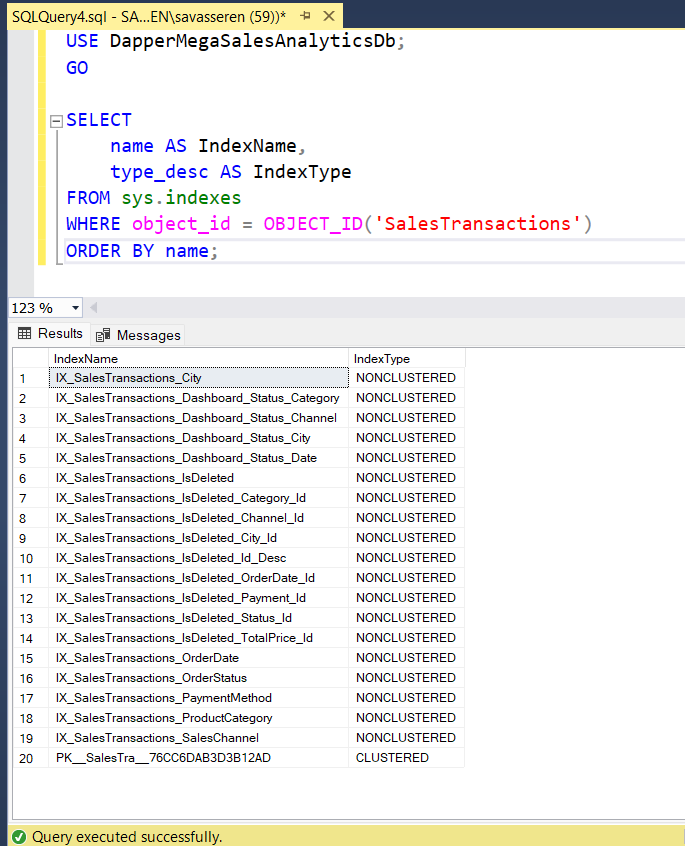

# Dapper Mega Sales Analytics

A high-performance ASP.NET Core MVC analytics project built with **Dapper**, **SQL Server**, and a layered architecture.

This project works on a synthetic large-scale e-commerce sales dataset with **2,000,000+ transaction records** and focuses on dashboard analytics, advanced filtering, server-side pagination, and SQL performance optimization.

---

## Project Overview

**Dapper Mega Sales Analytics** is a portfolio project designed to demonstrate how Dapper can be used in a real-world large dataset scenario.

The project includes:

* Premium dark analytics dashboard
* 2M+ sales transaction records
* Server-side pagination
* Advanced SQL filtering
* Dapper-based data access layer
* Layered architecture
* SQL performance indexes
* Update and soft delete operations
* Chart-based business insights

---

## Technologies Used

* ASP.NET Core MVC
* .NET 8
* Dapper
* SQL Server
* N-Tier Architecture
* Bootstrap 5
* Bootstrap Icons
* Chart.js
* HTML5 / CSS3
* JavaScript

---

## Architecture

The project follows a clean layered structure:

```txt
DapperMegaSalesAnalytics
│
├── DapperMegaSalesAnalytics.EntityLayer
├── DapperMegaSalesAnalytics.DtoLayer
├── DapperMegaSalesAnalytics.DataAccessLayer
├── DapperMegaSalesAnalytics.BusinessLayer
└── DapperMegaSalesAnalytics.WebUI
```

### Layer Responsibilities

| Layer           | Responsibility                              |
| --------------- | ------------------------------------------- |
| EntityLayer     | Database entity models                      |
| DtoLayer        | Data transfer objects                       |
| DataAccessLayer | Dapper queries and SQL operations           |
| BusinessLayer   | Service abstraction and business flow       |
| WebUI           | MVC controllers, views, UI and presentation |

---

## Main Features

### Premium Analytics Dashboard

The dashboard provides a visual overview of the sales dataset.

Dashboard includes:

* Total revenue
* Total orders
* Total customers
* Average order value
* Monthly revenue trend
* Revenue by category
* Order status distribution
* Payment method analysis
* Sales channel distribution
* Top cities by revenue
* High value transactions table



---

### Sales Transactions Data Grid

The sales page is designed for large-scale data management.

Features:

* Server-side pagination
* Advanced filters
* Search by transaction ID
* Search by customer, email, order number or product
* Filter by city
* Filter by category
* Filter by order status
* Filter by payment method
* Filter by sales channel
* Date range filtering
* Price range filtering
* Update transaction
* Soft delete transaction



---

### Advanced Filtering

Filtering is handled on the SQL Server side with dynamic Dapper queries.

This approach avoids loading unnecessary data into memory and keeps the UI responsive even with millions of rows.



---

### Update Transaction

Transactions can be updated directly from the data grid.

When quantity or unit price changes, total price is recalculated before saving.



---

## Large Dataset

The project was tested with more than:

```txt
2,000,000 sales transaction records
```

The dataset includes realistic e-commerce fields such as:

* Order number
* Customer name
* Customer email
* City
* Country
* Product name
* Product category
* Quantity
* Unit price
* Total price
* Order status
* Payment method
* Sales channel
* Order date
* Delivery day
* Customer age

---

## SQL Performance Strategy

To improve performance on the large dataset, multiple SQL indexes were added for:

* Pagination
* Filtering
* Dashboard aggregation queries
* Category revenue analysis
* City revenue analysis
* Status-based reporting
* Payment method reporting
* Sales channel reporting



Example index strategy:

```sql
CREATE INDEX IX_SalesTransactions_IsDeleted_Id_Desc
ON SalesTransactions(IsDeleted, SalesTransactionId DESC);

CREATE INDEX IX_SalesTransactions_Dashboard_Status_Category
ON SalesTransactions(IsDeleted, OrderStatus, ProductCategory)
INCLUDE (TotalPrice);
```

---

## Dapper Usage

The project uses Dapper for direct SQL execution and high-performance data access.

Example structure:

```csharp
using var connection = _context.CreateConnection();

var values = await connection.QueryAsync<ResultSalesTransactionDto>(
    query,
    parameters
);
```

Dapper is used for:

* Reading paged transaction data
* Counting filtered records
* Dashboard summary queries
* Chart data queries
* Updating transactions
* Soft deleting transactions

---

## Example Dashboard Queries

The dashboard uses SQL aggregate queries to calculate business metrics.

Examples:

* Total transactions
* Total revenue
* Average order value
* Monthly revenue
* Top categories
* Top cities
* Order status distribution
* Payment method distribution
* Sales channel distribution

---

## Pages

| Page               | Description                               |
| ------------------ | ----------------------------------------- |
| `/Dashboard/Index` | Premium analytics dashboard               |
| `/Sales/Index`     | Large dataset transaction management page |

---

## Setup Instructions

### 1. Clone the Repository

```bash
git clone https://github.com/SavashSheren/DapperMegaSalesAnalytics.git
```

### 2. Open the Project

Open the solution in Visual Studio.

```txt
DapperMegaSalesAnalytics.sln
```

### 3. Configure SQL Server Connection

Update the connection string in:

```txt
DapperMegaSalesAnalytics.WebUI/appsettings.json
```

Example:

```json
{
  "ConnectionStrings": {
    "DefaultConnection": "Server=YOUR_SERVER_NAME;Database=DapperMegaSalesAnalyticsDb;Trusted_Connection=True;TrustServerCertificate=True;"
  }
}
```

### 4. Create the Database

Create a SQL Server database named:

```txt
DapperMegaSalesAnalyticsDb
```

### 5. Run Database Scripts

Run the SQL scripts inside the `DatabaseScripts` folder.

Recommended order:

```txt
DatabaseScripts/02_PerformanceIndexes.sql
```

> Note: The project was developed and tested with a synthetic 2M+ row SQL Server dataset.

### 6. Run the Project

Start the WebUI project:

```txt
DapperMegaSalesAnalytics.WebUI
```

Then open:

```txt
/Dashboard/Index
```

or

```txt
/Sales/Index
```

---

## Project Highlights

* Built with ASP.NET Core MVC and Dapper
* Tested with 2M+ SQL Server records
* Clean layered architecture
* Premium dark dashboard UI
* Advanced server-side filtering
* SQL performance indexes
* Realistic analytics use case
* Portfolio-ready project structure

---

## Why This Project?

This project was created to show how Dapper can be used in a large dataset scenario with clean architecture and modern UI design.

The main goal was not only to build CRUD operations, but also to demonstrate:

* Performance-focused data access
* SQL optimization
* Dashboard reporting
* Large dataset handling
* Professional UI presentation
* Realistic portfolio project quality

---

## Author

**Savaş Şeren**

GitHub: [SavashSheren](https://github.com/SavashSheren)

---

## Repository

[View Project on GitHub](https://github.com/SavashSheren/DapperMegaSalesAnalytics)
